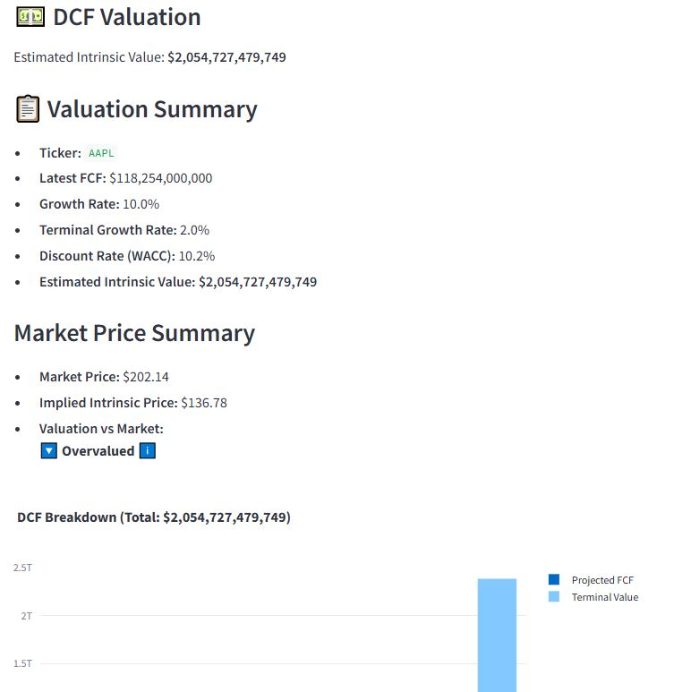
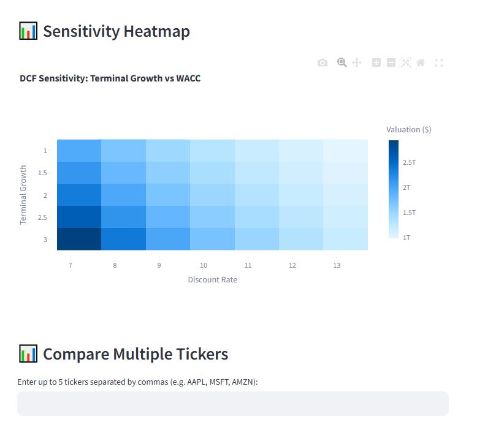
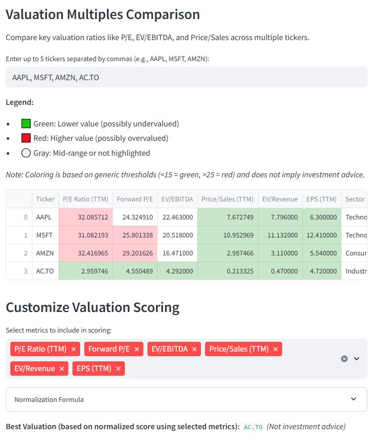

# 💼 Open Source Valuation Toolkit

A powerful, interactive Streamlit app for performing company valuations using fundamental methods. Supports DCF, DDM, and Comps with visuals and explanatory guidance.

> 📊 “Because nobody wants to waste their time on stock analysis.”

---

## 🚀 Features

- **📈 Discounted Cash Flow (DCF)**
  - Gordon Growth & Exit Multiple terminal value models
  - Auto or manual WACC (CAPM-based)
  - Sensitivity heatmaps
  - Multi-ticker comparison mode
  - Clean visualizations and markdown summaries

- **💸 Dividend Discount Model (DDM)**
  - Single-stage and multi-stage modeling
  - TTM yield and payout sustainability checks
  - Projected dividend growth chart
  - Fair value vs market price with clear guidance

- **📊 Valuation Multiples (Comps)**
  - P/E, D/E, EV/EBITDA, Price/Sales, and more
  - Custom metric selection for scoring
  - Z-score normalization with best-value ranking
  - Radar charts, bar charts, and color-coded tables

- **💬 UX & Design**
  - Intuitive Streamlit interface
  - Tooltips on all inputs
  - Currency-aware outputs (based on reported financials)
  - “Not investment advice” disclaimers built-in

---

## 🛠 Tech Stack

- Python 3.10+
- [Streamlit](https://streamlit.io/)
- [yfinance](https://github.com/ranaroussi/yfinance)
- Plotly, Pandas, NumPy
- Modular architecture with clean code split across:
  - `/valuation/` → logic for DCF, WACC, financials
  - `/visualizations/` → Plotly chart utilities

---

## 📸 Screenshots

| DCF Summary | Sensitivity Heatmap | Comps Comparison |
|-------------|----------------------|------------------|
|  |  |  |

---

## 💡 Usage

1. Clone the repo:
   ```bash
   git clone https://github.com/yourusername/valuation-toolkit.git
   cd valuation-toolkit

2. Install dependencies:
   ```bash
   pip install -r requirements.txt

3. Launch the app:
   ```bash
   streamlit run app.py

---

## 🧠 Inspiration

Wanted to create a super easy to use tool that can both help myself and others in their stock analysis.

---

## 📩 Contact

Built with ❤️ by [Daniel Stewart](https://www.becomingdanielstewart.com/)

[LinkedIn](https://www.linkedin.com/in/danthemans/) · [GitHub](https://github.com/dstew1) · [YouTube](https://www.youtube.com/@explorerpreneur)

---

## 📜 Disclaimer

This tool is for educational and informational purposes only.
It is not investment advice. Always do your own research.


   
